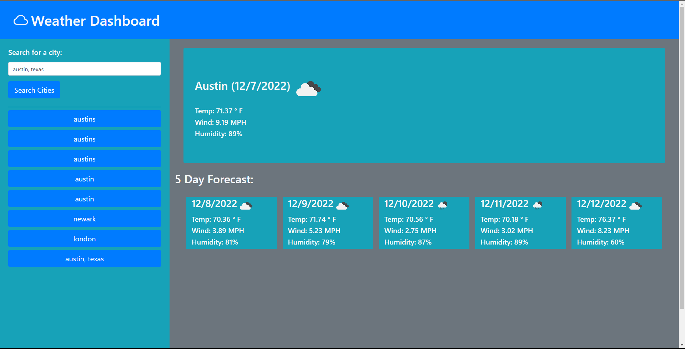

# Weather-Dashboard
Challenge 6 for the UTA Bootcamp, which displays a 5-day weather forecast for cities.

## Description
The problem for challenge 6 is to create a webpage which displays a 5-day weather forecast for a city that you search, using the OpenWeather API.

## Preview

## Usage
To use the webpage, go to https://allenwang1999.github.io/Weather-Dashboard using your browser and search a city on the left bar.

## License
MIT License; refer to the <a href="LICENSE">LICENSE</a> file in the repo.
